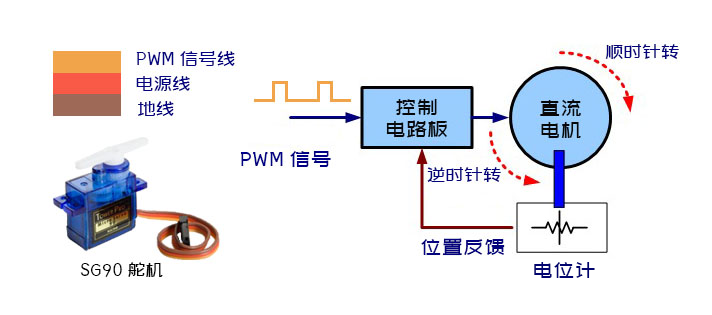
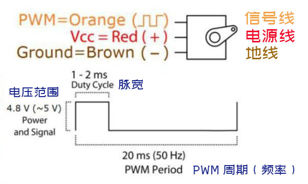
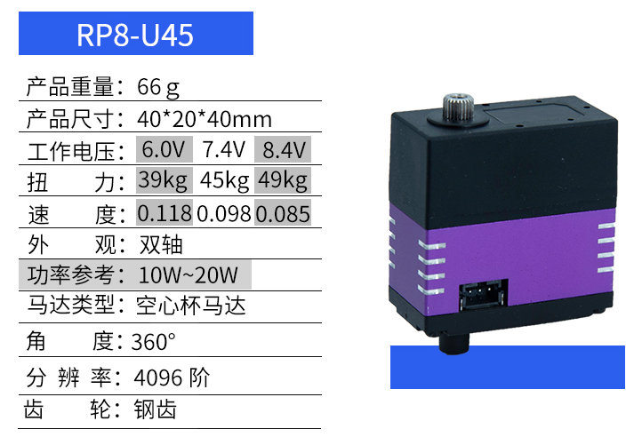
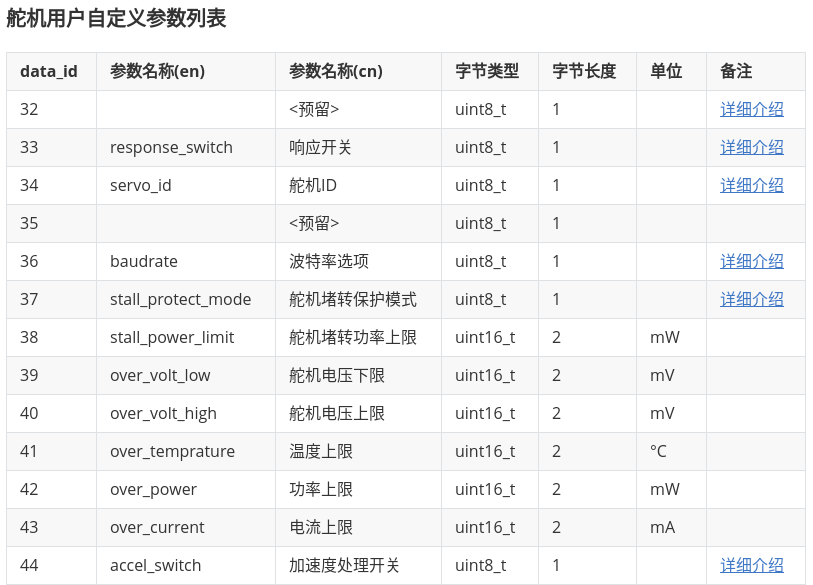

# 串行总线智能舵机

[TOC]

## 概要

本文介绍了串行总线舵机的一些基本概念，对比传统PWM舵机，分析了串口总线舵机的优势。

文末是大家对串口舵机常见问题的汇总与解答。

## 传统PWM舵机存在的问题

在介绍串行总线智能舵机之前，需要先了解传统的PWM舵机存在哪些不足。

传统的PWM舵机也叫数字比例舵机（例如SG90舵机），属于模拟舵机中的一种。单片机需要生成**PWM（脉冲方波调制）信号**发送给传统PWM舵机，通过调节PWM信号的脉宽来控制传统PWM舵机的角度。

传统PWM舵机存在的主要问题如下所示：

**占用硬件资源，接线杂乱**

 1. 一个舵机需要占用一个GPIO，而且这个GPIO接口需要支持PWM信号输出。另外还会占用单片机的定时器资源。当机器人自由度很多的时候（例如六自由度机器人，多足机器人）单片机的IO资源就不够了。

    所有的舵机线都直接与单片机相连，当舵机比较多时，接线就会显得非常杂乱，另外这种接线方式本身也会影响到机器人关节的旋转。 

 2. **精度差**

     PWM的分辨率是同时受限于单片机（发送端）与舵机（接受端）双方的。举例来讲，舵机的角度是0-180度，Arduino Uno的PWM输出信号的分辨率是255，0-255对应脉宽是0-20ms，但是PWM舵机只响应0.5-2.5ms的脉宽，所以实际上Arduino控制舵机的理论精度是**7.05°。**

$$
\frac{180}{255 * \frac{2.5-0.5}{20}} = 7.05
$$

​	另外这里舵机角度的控制精度的计算还没有考虑单片机定时器的精度，舵机接收PWM信号的分辨率，舵机电位计分辨率，还有舵机死区等诸多因素，都会影响到舵机的精度。

 3. **开环控制，无角度反馈** 

    PWM信号是从单片机单方向发送给PWM舵机的，电位计虽然可以采集舵机的角度，但是采集的信号并不会反馈给单片机。所以单片机控制舵机属于开环控制，单片机并不能知道舵机当前是否旋转到了目标位置。

    另外, 当机器人初始化的时候，因为不知道当前的位置，舵机偏移初始位置（bias）较大的时候，会出现舵机旋转过快，误伤到机器或者人。

 4. **无轨迹规划，抖动不连贯** 

    PWM舵机有轨迹规划，当需要控制舵机关节从一个角度缓慢的旋转到另外一个角度的时候需要开发者自己在单片机内部实现舵机的关节角度的插值算法与轨迹规划，工作量比较大。

    PWM舵机用在机械臂上，受限于控制周期以及角度分辨率，当关节慢速旋转的时候，会出现动作不连贯，抖动的问题。

 5. **舵机无保护，容易烧毁** 

    舵机构造比较简单，没有舵机保护的功能。当出现舵机卡齿或者关节卡出等情况，舵机容易烧毁。虽然单个PWM舵机比较便宜，但是算上舵机烧毁的损耗以及开发者的时间成本，PWM舵机并不"便宜"。

所以传统的PWM舵机比较适合做玩具，不适合用在对精度还有动作流畅度有要求的机器人上.

## 串行总线舵机的优势

串行总线舵机是对一大类舵机的统称，并没有一套统一的标准协议，每个舵机厂商都有自己的通信协议，功能以及硬件配置也各不相同。这里以[Fashion Star(华馨京)公司的串口舵机RP8-U45](https://item.taobao.com/item.htm?spm=a1z10.5-c-s.w4002-21603752570.16.790f6ea1jU42b8&id=600130669485)为例，讲解串口舵机的相关概念。

**RP8-U45**舵机使用的通信协议为**单线半双工异步串行通信** (Half duplex Asynchronous Serial Communication)，使用的电平标准为**TTL电平**（TTL Level）。信号线只有一根，同时负责舵机指令的发送与接收，数据发送与接收只能交替进行。串口舵机**内置MCU**，串口舵机两侧各有一个接口，通过转接线串口舵机就可以**串联在一条串行总线上**。

串口舵机需要配合**串口舵机转接板**使用，它的作用是将串口舵机的单线转换为双线TTL接口（Rx接收端，Tx发送端），通过双线TTL串口接口跟单片机进行通信。或者通过转接板上的USB转TTL芯片（CH340），通过USB端口与PC进行通信。

串口舵机与PC/单片机之间按照特定的**串口通信协议**进行指令传递与反馈数据的解析。

串口总线舵机有如下优势:

1. **硬件资源占用少**

   通过单片机控制串口舵机，只需要占用两个GPIO管脚（串口的接收端与发送端） 就可以控制最多254个舵机。
   
2. **PC可以直接控制舵机**

   电脑如果想控制传统的PWM舵机的话，中间必须要通过一个单片机，并且要开发PC与单片机的串口通信协议。

   对于串口总线舵机来讲，借由转接板，PC可以直接给每个串口舵机发送控制指令，对于产品开发或者算法验证就显得非常高效。另外通过PC控制串口舵机，只需要占用一个USB口。

3. **布线美观**

   串口总线舵机串联的方式，极大的简化了接线的复杂度。

4. **舵机精度高**

   串口舵机是通过串口通信的方式，将舵机角度按照通信协议写入到字节流数据中，角度传递更可靠且准确。

   **RP8-U45** 这款舵机是4096阶的，假设舵机角度范围是0-270°,  那么理论上它的控制精度就是**0.066°**
   $$
   \frac{270}{4096} = 0.066
   $$

5. **数据反馈，舵机保护**

   串口舵机的角度、电压、电流、温度 均可以通过串口通信协议发送给单片机/PC。

   通过反馈得到的舵机角度，可以知道舵机是否到达目标角度。在舵机的阻尼模式下，还可以周期性的对舵机角度进行采样，用于机械臂示教。另外当检测到负载过大的时候，可以卸力，不会烧坏舵机。

6. **内置轨迹规划，平滑流畅**

   内置轨迹规划算法，操作简单。只需要指定起始位置还有终止位置以及中间的时间间隔，舵机会自动规划轨迹，控制舵机平滑的旋转到目标角度。

7.  **功能丰富， 一机多用**

   **RP8-U45** 串口舵机除了舵机模式外，还具有如下模式：

   **轮式控制模式**：舵机可以用于小车，舵机支持360度旋转，支持定速与定圈控制。

   **阻尼控制模式**：阻尼模式下，对舵机角度周期性轮巡，通过手持机械臂旋转关节的方式，完成示教。

   **智能抓取模式**：舵机可以用于机械臂的夹具，根据舵机的电流，智能的调整抓取的力度，防止损坏物体。

8. **支持用户自定义参数设置**

   串口舵机有一个用户自定义参数列表, 用户可以根据自己的需求对舵机进行个性化设置. 部分舵机自定义参数如下图所示：

   

## 常见问题

**问题1:串口舵机支持哪些单片机(MCU)/PC?**

对于PC来说，只要PC有USB端口（无论是USB2.0接口还是USB3.0接口）都支持，但是因为转接模块是USB2.0的，所以即便是接到USB3.0接口上，也只有USB2.0的速度。

对于单片机来说，只要单片机上有串口硬件资源就可以驱动串口舵机。Arduino、C51、STM32等等都是支持的。

**问题2: 串口舵机支持哪些操作系统(OS)?**

任意操作系统都支持，Windows、Linux、Mac都可以使用该串口舵机产品。

官方提供了Python SDK，Python本身是跨平台的，在所有的平台下都可以使用。只不过不同操作系统的设备号的命名方式各不相同，所以需要修改一下设备号。

**问题3: 串口舵机支持哪些编程语言?**

任意编程语言都支持，如果官方没有对你所使用的语言开发相应的SDK，则需要参阅串口舵机的通信协议，根据通信协议自行开发相关的SDK。
