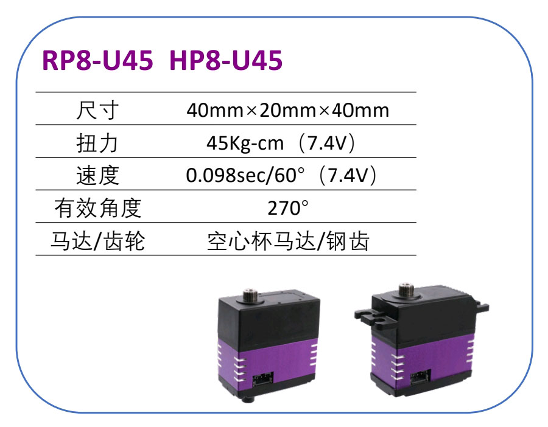
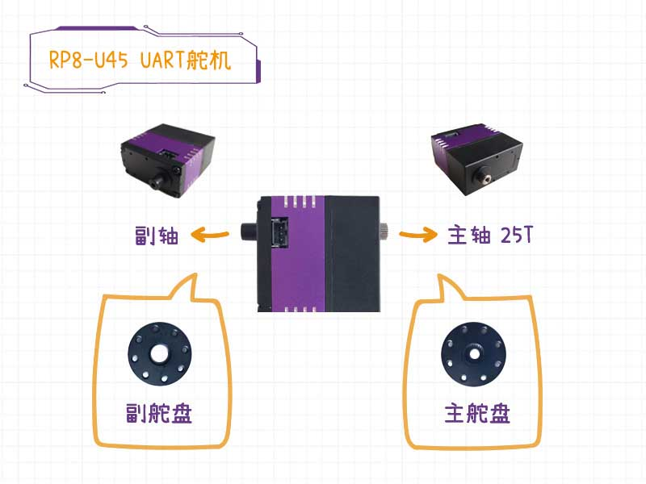
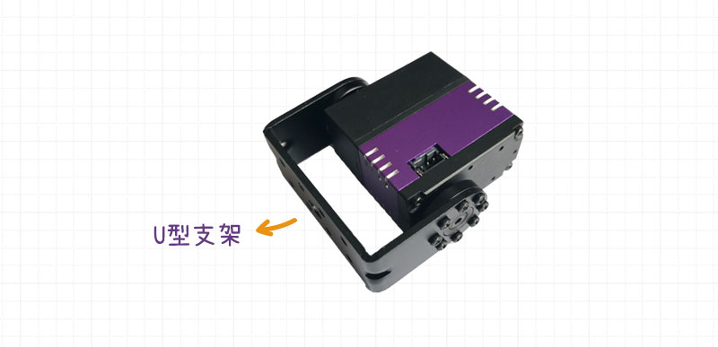
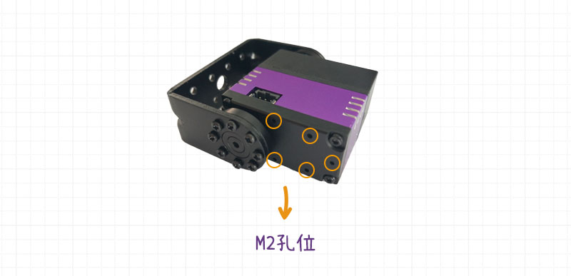
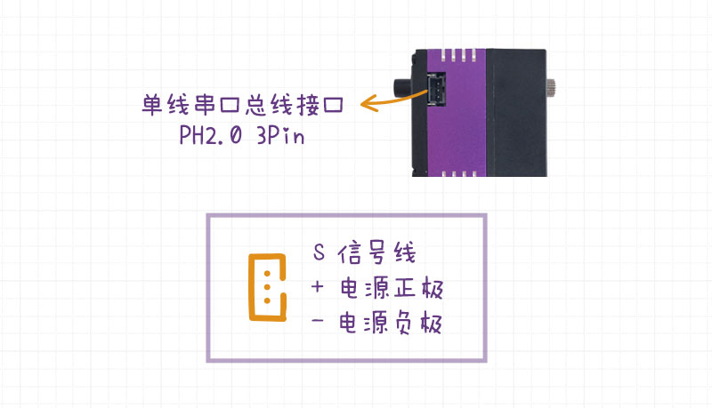
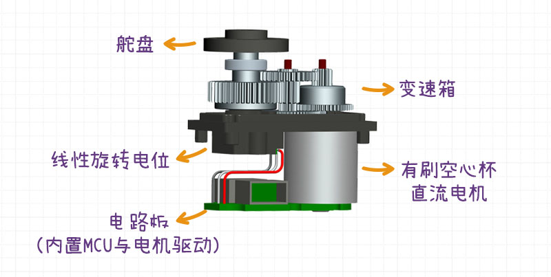
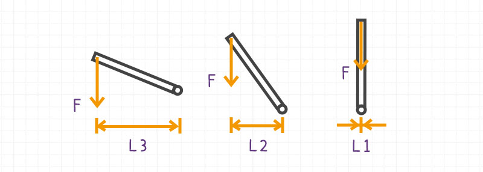
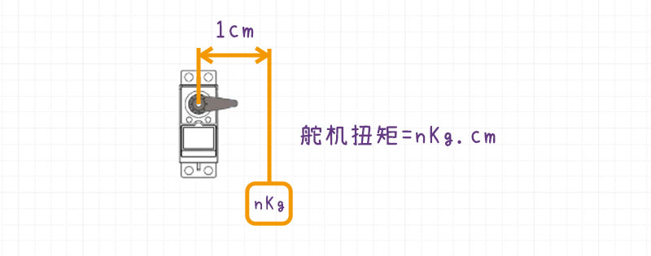
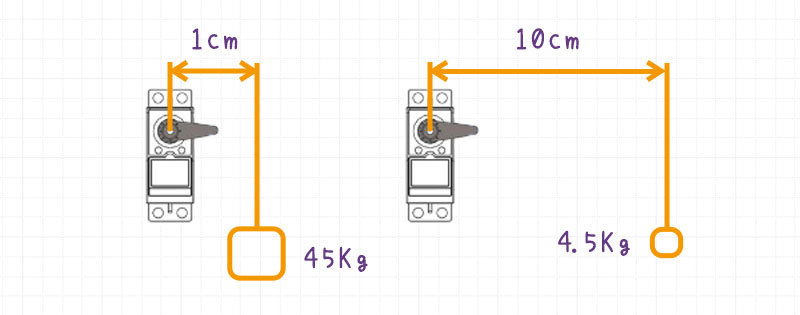

# UART舵机的结构与参数

[toc]

## 概要

以**标准UART舵机(型号: RP8-U45)**为例，介绍舵机的外部特征、内部结构、舵机参数与组成部分的对应关系。

## 舵机外部结构

**标准UART舵机(型号: RP8-U45)**的外壳由以下几部分构成：

* 舵机的上下盖，是用高强度的工程塑料精密注塑而成；
* 中段材质采用6063铝合金, 经由CNC精密加工而成，内壁贴合马达，有利于电机与电路板的散热，提高电机的运行效率。

**RP8-U45舵机**有两个轴，分别为主轴和副轴。**主轴（Output Spline）**也叫舵机的**输出轴**, 是舵机齿轮组的最后一级齿轮. 采用不锈钢材料, 经由数控车床加工而成，满足舵机高强度和高精度的要求。

**副轴** 也叫**从动轴**，是一个光滑轴，和输出轴同心，用于分担主轴的压力。

**输出轴**的规格为25T。

> 注: 齿轮规格的**25T**，T代表的是齿轮的齿数（Teeth），所以25T代表齿轮有25个齿。

**舵盘（Metal Servo Horn）**,也分主舵盘和副舵盘，分别和主轴及副轴配对使用 。舵盘用于将输出轴与连杆或其他结构件（例如U型支架）连接。舵盘不但要和输出轴紧密结合，避免虚位产生，也要提供稳固的链接，方便各类支架安装。

RP8-U45舵机搭配的舵盘，是用7075航空铝合金材质CNC加工而成，采用沉降式台阶设计，并提供8个孔位，方便用户实现各个角度的安装。

另外RP8-U45舵机外壳上输出轴所在的两面，各有5个全对称的M2螺丝孔位，方便舵机与其他机械结构件的连接。

> 注: M2中M代表（公制 Metric），2是指的螺丝的直径为2mm。

舵机正反两面各有一个单总线串口接口。

> **单总线** : UART通信接收端(Rx)跟发送端(Tx)共用一根线, 数据发送与接收分时复用(半双工).

通过舵盘，U形支架与其他金属结构件，就可以搭建出任意自由度的机械臂/云台。

## 舵机内部结构

去掉金属外壳之后, 我们可以看到齿轮组，电位器，直流马达以及控制电路板。

1. **空心杯直流电机  | Coreless DC Motor** 

   舵机里面的驱动器就是直流电机（DC Motor)，直流电机也分为很多种不同的类型。RP8-U45 舵机所采用的电机类型为空心杯直流电机。

2. **减速齿轮箱  | Reduction Gear Box**

   一般直流电机的转速比较快，但是扭矩小，所以直流电机的输出轴并不能直接作为舵机的输出轴。需要经过变速箱（减速齿轮）。齿轮组对直流电机进行减速，同时增大输出轴的扭矩。

3. **线性旋转电位计 | VR**

   线性电位计也被称之为可变电阻器（VR，Variable Resistor）。旋转电位计与输出轴同轴，输出轴的角度旋转位移会按照线性关系转换为电阻的阻值。电路板上的MCU对电位计的电阻稳压电路进行ADC采样。通过ADC采样的电压值进一步得出当前舵机输出轴的角度，并给出目标位置的控制指令。

4. **电路板 | Circuit Board**

   电路板上有单片机（MCU），电机驱动，电压测量电路，电流测量电路，温度感测线路，电位器ADC采样电路等。单片机负责接受单总线串口发送过来的各类指令，根据当前的运动状态以及目标运动状态进行计算，控制直流电机旋转，与此同时通过电位器的ADC采样获得舵机输出轴角度反馈信息。

## 舵机参数

### 控制方式

**标准UART舵机(型号: RP8-U45)** 使用的通信协议为**单线半双工异步串行通信**（Half duplex Asynchronous Serial Communication），使用的电平标准为**TTL电平**（TTL Level）。

> 注: 单线半双工异步串行通信是**UART(Universal Asynchronous Receiver/ Transmitter)** 通信协议中的一种.

**单线**的意思是信号线只有一根，同时负责舵机指令的发送与接收，数据发送与接收只能交替进行。 UART舵机两侧各有一个接口，通过转接线UART舵机就可以**串联在一条串行总线上**。

UART舵机需要配合**UART舵机转接板**使用，它的作用是将UART舵机的单线转换为双线TTL接口（Rx接收端，Tx发送端），通过双线TTL串口接口与单片机进行通信。或者通过转接板上的USB转TTL芯片（CH340），通过USB端口与PC进行通信。

UART舵机与PC/单片机之间按照特定的**串口通信协议**进行指令传递与反馈数据的解析。

### 舵机输入电压

舵机输入电压范围是6v-8.4v。舵机有欠压保护与过压保护，当输入电压超出额定电压范围时，电机的电流不导通。

### 保持力矩与堵转力矩

**保持力矩**，是指机械臂在静止状态下，舵机保持在特定角度，所需要的**力矩**（Torque，单位是$N*m$）。下图是一个理想模型，忽略了连杆的重量，连杆的末端有一个质量为$m$ 的物体。

$$
T = F*L
$$

摇臂水平时，$L$ 与摇臂长度相同，此时舵机的保持力矩最大。

国内的**堵转扭矩**（Stall Torque）计算方式为，在舵盘上距离舵机主轴轴心位置处1cm的位置，舵机可以静挂的物体重量（单位 Kg），即为**摇臂为1cm时的保持力矩**。

 舵机的堵转力矩有两套单位，一套是国际单位 $N*m$ ，另外一套是$kg*cm$ 。二者之间的换算关系如下：
$$
g = 9.80665  m/s^2
$$

$$
1 N = g * kg
$$

$$
1 m = 100cm
$$

$$
1 N*m =\frac{100}{g} = 10.197  kg*cm
$$

舵机的堵转力矩与电压有关系，电压越高直流电机的输出功率也就越大，堵转力矩因此也会增大。

| 电压  | RP8-U45的堵转力矩 |
| ----- | ----------------- |
| 6.0 v | 39 kg*cm          |
| 7.4 v | 45 kg*cm          |
| 8.4 v | 49 kg*cm          |

当电压为7.4V时，摇臂长度为1cm的时候可以负载45kg的重物。根据**杠杆原理**可知，当臂长为10cm的时候，最多能负载4.5kg的重物。

### 空载最高转速

国内舵机转速的表示方法一般以**舵机空载时输出轴转过60度所需的时间**（单位 sec/60°）为参考。舵机空载的含义是，舵盘上没有负载，不悬挂任何负载的重物。同样，舵机转速与电压有关，电压越高电机的输出功率也就越高，输出轴的转速也就越高。

| 电压  | RP8-U45的舵机转速(sec/60°) |
| ----- | -------------------------- |
| 6.0 v | 0.118                      |
| 7.4 v | 0.098                      |
| 8.4 v | 0.085                      |

举例来讲，在7.4v的时候，舵机RP8-45在舵机空载的模式下，从0度旋转到60度仅需要0.098s。　

### 减速比 

**减速比**（别名 齿比，Reduction Ratio）是由变速箱里面所配置的齿轮组决定的，减速比/齿比的定义是变速箱输入轴的转速与变速箱输出轴转速的比值。**标准UART舵机(型号: RP8-U45)的减速比为273:1，也可以简写为273。**

我们来看一个简单的抽象模型，将整个变速箱想象为一个大齿轮。假定直流电机主轴上的小齿轮是10齿的，大齿轮是100齿的。大齿轮旋转一圈，小齿轮就需要旋转10圈。假如1s内小齿轮可以旋转$n$圈（电机转速为 $n$转/s），大齿轮1s内只能旋转$n/10$ 圈（输出轴的转速为 n/10 转/s）。

所以减速比为
$$
\frac{n}{n/10} = \frac{100}{10} = 10
$$

一个直流电机，如果减速比越大，舵机输出轴的最大转速越慢，扭矩也就越大。同理，减速比越小舵机输出轴的最大转速越快，扭矩也就越小。

 所以在选择舵机的时候，需要在扭矩与转速之间做取舍，根据自己的需求选择合适的减速比的舵机。举例来讲，假如舵机是用在机械臂上，舵机的转速要求不高，但是对负载有要求，这个时候就需要选择减速比较大的舵机。如果UART舵机是应用在小车上（轮式模式），对小车轮子的转速有要求，此时就需要选择减速比较小的舵机。