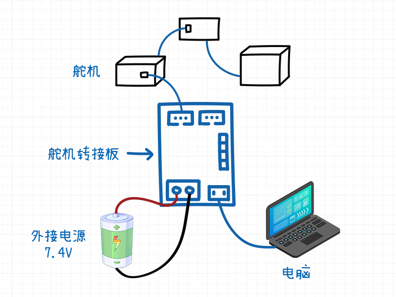
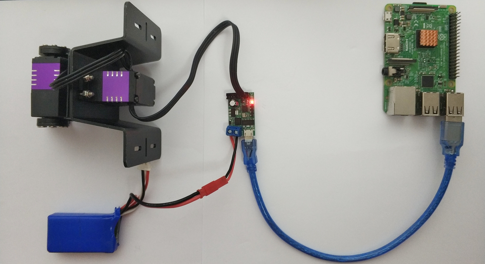
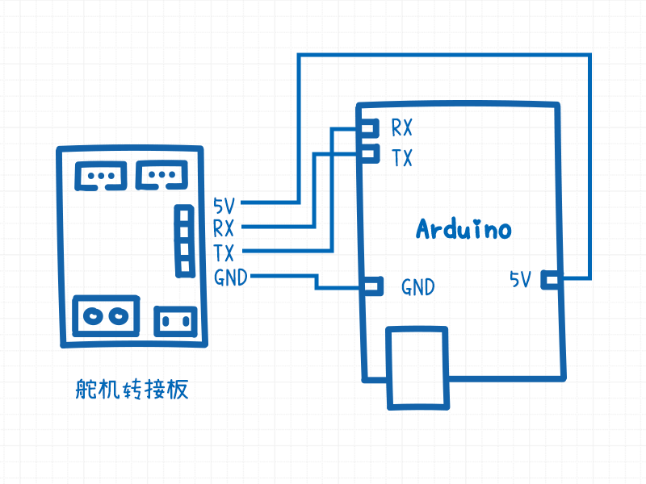

# 转接板规格与接线说明

[TOC]

## 概要

串口舵机需要配合**串口舵机转接板**使用，它的作用是将串口舵机的单线转换为双线TTL接口（Rx接收端，Tx发送端），通过双线TTL串口接口与单片机进行通信。或者通过转接板上的USB转TTL芯片（CH340），通过USB端口与PC进行通信。

## 转接板规格

| 类目             | 内容         |
| ---------------- | ------------ |
| 生产商           | Fashion Star |
| 型号             | UC01-V1.0    |
| 输入电压范围     | 6-8.7 V      |
| USB接口型号      | mini USB     |
| USB转TLL芯片     | CH340        |
| 串口舵机接口数   | 2            |
| 舵机接口端子型号 | PH2.0 3Pin   |
| 舵机最大串联数   | 254          |

转接板上有两个串口舵机的插槽，任选其中一个，通过舵机接线将串口舵机与转接板相连接，插槽有防反插设计，所以不用担心接反。

另外**外接电源**在给串口转接板供电的同时也给串口舵机进行供电，**外接电源的电压范围取决于串口舵机的电压范围**。 

## 转接板功能描述

### 功能1: USB转单线TTL

通过USB线将串口转接板与电脑连接。

如果电脑是Windows系统，可以通过舵机调试软件测试舵机相关的功能。如果是其他操作系统，可以通过SDK测试舵机相关功能。

*示意图* 

*实物图* 以树莓派与2DoF串口舵机云台之间的连接为例

### 功能2: TTL双线转单线

如果是使用单片机（Arduino/STM32/C51/TI等）与串口舵机进行通信，需要将串口舵机转接板的**TTL串口接口**与单片机相连。

*示意图* 以Arduino为例演示接线方法

| 舵机转接板 | Arduino |
| ---------- | ------- |
| GND        | GND     |
| TX         | RX      |
| RX         | TX      |
| 5V         | 5V      |

**备注** 

1. 舵机转接板的工作电压是5V，请不要将5v电压接到单片机的3.3V管脚上，防止单片机芯片烧毁。若单片机独立供电，则舵机转接板的5v管脚可以悬空。
2. `RX`代表接收端， `TX` 代表发送端。

### 功能3: USB转TTL串口

串口舵机转接板也可以当成普通的USB转TTL串口模块来使用。

