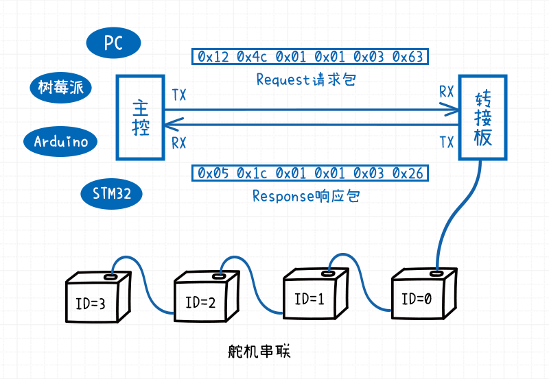
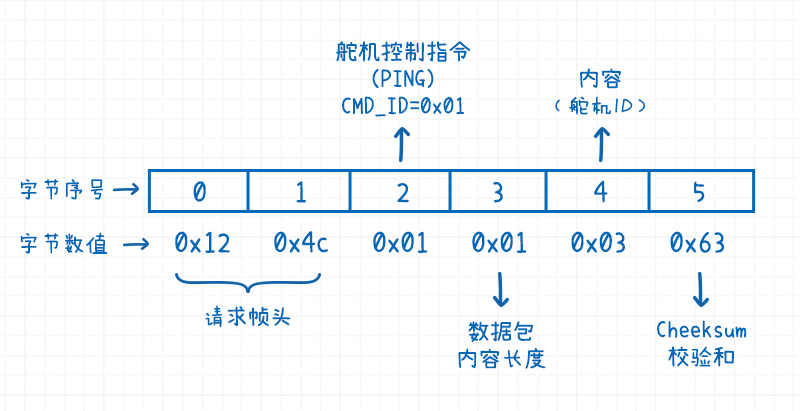
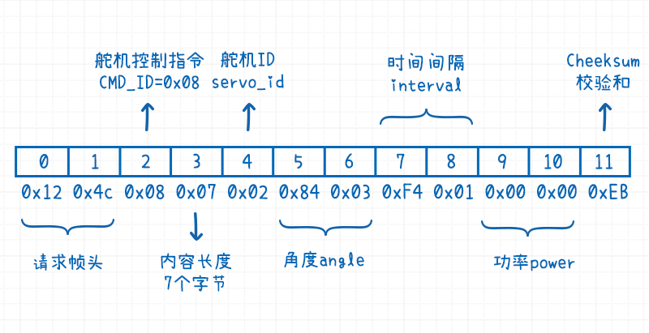
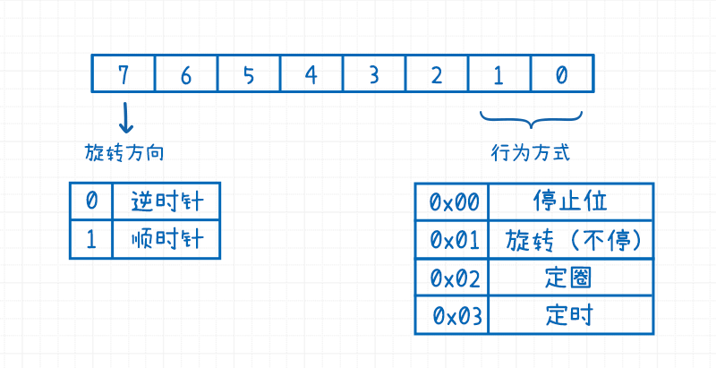

# UART舵机通信协议

[TOC]

## 串口通信配置

| 参数名称(en) | 参数名称(cn) | 参数数值 | 备注                                                         |
| ------------ | ------------ | -------- | ------------------------------------------------------------ |
| baudrate     | 波特率       | 115200   | 串口舵机支持的多种波特率，参见[<参数>波特率选项](#<参数>波特率选项) |
| parity       | 奇偶校验     | 无       |                                                              |
| stopbits     | 停止位       | 1        |                                                              |
| bytesize     | 字节长度     | 8        |                                                              |


## 数据类型说明

串口通讯协议里用到的数据类型 (字节大小，取值范围) 

| 数据类型   | 数据名称(en)   | 数据名称(cn) | 字节长度 | 最小值      | 最大值     |
| ---------- | -------------- | ------------ | -------- | ----------- | ---------- |
| uint8_t    | byte           | 字节()       | 1        | 0           | 255        |
| uint16_t   | unsigned short | 无符号短整型 | 2        | 0           | 65535      |
| int16_t    | signed short   | 有符号短整数 | 2        | -32768      | 32767      |
| uint32_t   | unsigned long  | 无符号长整数 | 4        | 0           | 4294967295 |
| int32_t    | signed long    | 有符号长整数 | 4        | -2147483648 | 2147483647 |
| uint8_t[n] | byte array     | 变长字节数组 | n        |             |            |

**注意事项**

1. 舵机通讯协议里面使用的字节序为**小端字节序**

   例如一个`uint16_t`的数值`4660`，它的十六进制表示为`0x1234`。

   在发送/接收时，低位字节在前，高位字节在后，即以`0x34 0x12`形式发送。

   > 计算机电路先处理低位字节，效率比较高，所以在大部分的MCU里面（例如STM32），默认字节序也是**小端字节序**。
   >
   > 拓展阅读: [理解字节序 大端字节序和小端字节序](https://www.cnblogs.com/gremount/p/8830707.html)             


## 串口舵机控制指令

串口舵机共支持10种舵机控制指令

| 指令ID | 指令名称(EN)     | 指令名称(CN)              | 备注                                                         |
| ------ | ---------------- | ------------------------- | ------------------------------------------------------------ |
| 1      | PING             | 舵机通讯检测              | 检查舵机是否在线                                             |
| 2      | RESET_USER_DATA  | 用户自定义数据重置        | 重新将用户自定义数据设置为默认值                             |
| 3      | READ_DATA        | 舵机数据读取              | 读取单个用户自定义参数，用户自定义参数的字节长度为变长       |
| 4      | WRITE_DATA       | 用户自定义数据写          | 写入单个用户自定义数据，用户自定义参数的字节长度为变长       |
| 5      | READ_BATCH_DATA  | 用户自定义数据批量读      | 读取所有的用户自定义数据，所有的用户自定义数据的字节长度为32字节 |
| 6      | WRITE_BATCH_DATA | 用户自定义数据批量写      | 写入所有的用户自定义数据，所有的用户自定义数据的字节长度为32字节 |
| 7      | SPIN             | 轮式模式控制              | 设置旋转方向，定速，定圈，定时                               |
| 8      | ROTATE           | 角度模式控制-设置舵机角度 | 设置舵机旋转的目标角度与时间间隔                             |
| 9      | DAMPING          | 阻尼模式控制              | 阻尼模式，设置舵机保持的功率                                 |
| 10     | READ_ANGLE       | 读取舵机角度              |                                                              |

**注意事项**

1. 所有的舵机指令都是针对单个舵机的。
2. 批量读/写针对的都是单个舵机的所有的用户自定义数据，而不是所有的舵机。
3. 发送控制指令之前，请确保串联在一起的舵机每个舵机的ID号都不一样。
4. 批量读跟批量写入针对的都是用户自定义参数区块。 


## 数据包

### 请求数据包

| 字节序号     | 数据类型   | 字段名称 | 字段功能描述                                                 | 字节长度 |
| ------------ | ---------- | -------- | ------------------------------------------------------------ | -------- |
| 0            | uint8_t    | 0x12     | 请求头 标识                                                  | 1        |
| 1            | uint8_t    | 0x4C     | 请求头 标识                                                  | 1        |
| 2            | uint8_t    | cmd_id   | **舵机控制指令ID**，详情见 *串口舵机指令集*                  | 1        |
| 3            | uint8_t    | n        | 数据包内容的字节长度                                         | 1        |
| $[4, 4+n-1]$ | uint8_t[n] | content  | **数据包的內容部分**，变长                                   | n        |
| $$4+n$$      | uint8_t    | checksum | 数据包的校验和。计算方法：对之前所有的字节数据求和(0号到4+N-1号字节)，然后跟256取余数 | 1        |

### 响应数据包

请求数据包跟响应数据包数据结构的唯一区别就在于前两个字节的标识符。

| 字节序号     | 数据类型   | 字段名称 | 字段功能描述                                                 | 字节长度 |
| ------------ | ---------- | -------- | ------------------------------------------------------------ | -------- |
| 0            | uint8_t    | 0x05     | 响应头标识                                                   | 1        |
| 1            | uint8_t    | 0x1C     | 响应头标识                                                   | 1        |
| 2            | uint8_t    | cmd_id   | **舵机控制指令ID**，详情见 *串口舵机指令集*                  | 1        |
| 3            | uint8_t    | n        | 数据包内容的字节长度                                         | 1        |
| $[4, 4+n-1]$ | uint8_t[n] | content  | **数据包的內容部分**，变长                                   | n        |
| $$4+n$$      | uint8_t    | checksum | 数据包的校验和。计算方法：对之前所有的字节数据求和(0号到4+N-1号字节)，然后跟256取余数 | 1        |

**注意事项**

1. 封包内容的第一个字节，往往是舵机的ID号，舵机的ID号取值范围为$[0, 254]$ ，255是舵机广播地址。

2. 字节序号是从0开始算的。

3. 请求包的`cmd_id` 跟响应包的`cmd_id` 一致。

4. 响应数据的接收流程

   如果你需要自己写串口舵机的通讯协议，可参考的响应数据包获取流程如下：

   *响应数据包数据读取伪代码*

   1. 读取帧头

      读取数据帧`0x05 0x1c` 如果不匹配就继续向下读，直到匹配。

   2. 读取控制指令 `cmd_id`

      读入下一个字节赋值给`cmd_id`，检查ID是否在$[1, 10]$ 之间。

   3. 读取字节长度`n` 

      读入下一个字节赋值给`n`。

   4. 读取数据包的内容`content`

      读入后续的连续`n`个字节，赋值给`content`。

   5. 读取校验码`checksum`  

      读取一个字节，赋值给`checksum`，并验证`checksum` 是否正确。

5. 数据包的样例可以参阅[<指令>舵机通讯检测](#<指令>舵机通讯检测)， [<指令>设置舵机角度](#<指令>设置舵机角度) 等。


## 舵机通讯检测

### <指令>舵机通讯检测

| 指令ID | 指令名称(EN) | 指令名称(CN) | 备注             |
| ------ | ------------ | ------------ | ---------------- |
| 1      | PING         | 舵机通讯检测 | 检查舵机是否在线 |

检查舵机是否在线，就需要用到PING指令。PING数据包的内容部分是舵机的ID。

如果ID号的舵机存在且在线，串口舵机在接收到PING指令时，会发送一个响应包。如果ID号的舵机不存在或者掉线，就不会有舵机发送响应数据包。在系统实现时，可以设置一个最大等待时间`timeout` , 如果等待超过`timeout ms` 就认为该ID号的舵机不在线。

#### 请求包内容格式


| 字节序号 | 数据类型 | 字段名称 | 字段功能描述 | 字节长度 |
| -------- | -------- | -------- | ------------ | -------- |
| 4        | uint8_t  | servo_id | 舵机ID       | 1        |

#### 响应包内容格式


| 字节序号 | 数据类型 | 字段名称 | 字段功能描述 | 字节长度 |
| -------- | -------- | -------- | ------------ | -------- |
| 4        | uint8_t  | servo_id | 舵机ID       | 1        |

#### 数据包示例

ping一下3号舵机

*请求数据包*

```
0x12 0x4c 0x01 0x01 0x03 0x63
```



> TODO 


*功能描述*  检查一下3号舵机是否在线。

这就需要**PING**（舵机通讯检测）一下编号为3的串口舵机。

* PING指令对应的指令ID `cmd_id = 0x01`

* 数据包的内容因为只有舵机的ID`servo_id = 0x03`，所以数据包内容的字节长度`n = 0x01`

* 计算校验和`checksum = (0x12 + 0x4c + 0x01 + 0x01 + 0x03)%256 = 99 = 0x63`




接下来分析一下回传数据，假设舵机存在并在线，返回的字节数据为

```
0x05 0x1c 0x01 0x01 0x03 0x26
```

* `0x05 0x1c` : 响应头标识符

* `0x01`:  `cmd_id` 这个包是PING指令的响应数据包

* `0x01`: `n` 响应数据包内容的长度是１

* `0x03`: `servo_id` 舵机的ID是`3`

* `0x38`: `checksum` 校验和

  我们拿到响应数据之后，要通过计算校验和`checksum`判断响应数据包的合法性。

  ` (0x05 + 0x1c + 0x01 + 0x01 +  0x03)%256  = 38 = 0x26 `

  校验和相等, 所以响应包的数据为合法。


## 舵机参数

舵机参数整体上分为用户只读参数（舵机型号，舵机状态等）和用户自定义参数两大类。


### 舵机参数设置/修改

#### <指令>用户自定义数据重置

| 指令ID | 指令名称(EN)    | 指令名称(CN)       | 备注                             |
| ------ | --------------- | ------------------ | -------------------------------- |
| 2      | RESET_USER_DATA | 用户自定义数据重置 | 重新将用户自定义数据设置为默认值 |

##### 请求包内容格式


| 字节序号 | 数据类型 | 字段名称 | 字段功能描述 | 字节长度 |
| -------- | -------- | -------- | ------------ | -------- |
| 4        | uint8_t  | servo_id | 舵机ID       | 1        |

##### 响应包内容格式


| 字节序号 | 数据类型 | 字段名称 | 字段功能描述                             | 字节长度 |
| -------- | -------- | -------- | ---------------------------------------- | -------- |
| 4        | uint8_t  | servo_id | 舵机ID                                   | 1        |
| 5        | uint8_t  | result   | 重置结果 .   `0` 重置失败,  `1` 重置成功 | 1        |


#### <指令>舵机数据读取

| 指令ID | 指令名称(EN) | 指令名称(CN) | 备注                                                         |
| ------ | ------------ | ------------ | ------------------------------------------------------------ |
| 3      | READ_DATA    | 舵机数据读取 | 读取单个用户自定义参数/舵机只读参数，用户自定义参数的字节长度为变长 |

##### 请求包内容格式


| 字节序号 | 数据类型 | 字段名称 | 字段功能描述                                                 | 字节长度 |
| -------- | -------- | -------- | ------------------------------------------------------------ | -------- |
| 4        | uint8_t  | servo_id | 舵机ID                                                       | 1        |
| 5        | uint8_t  | data_id  | 舵机参数的ID , 定义参见[舵机只读参数](#舵机只读参数) 与 [舵机用户自定义参数](#舵机用户自定义参数) | 1        |

##### 响应包内容格式


| 字节序号       | 数据类型   | 字段名称 | 字段功能描述   | 字节长度 |
| -------------- | ---------- | -------- | -------------- | -------- |
| 4              | uint8_t    | servo_id | 舵机ID         | 1        |
| 5              | uint8_t    | data_id  | 舵机参数的ID   | 1        |
| $[6, 6+ n -1]$ | uint8_t[n] | data     | 舵机参数的取值 | n        |


#### <指令>用户自定义数据写


| 指令ID | 指令名称(EN) | 指令名称(CN)     | 备注                                                   |
| ------ | ------------ | ---------------- | ------------------------------------------------------ |
| 4      | WRITE_DATA   | 用户自定义数据写 | 写入单个用户自定义数据，用户自定义参数的字节长度为变长 |

##### 请求包内容格式


| 字节序号     | 数据类型   | 字段名称 | 字段功能描述                                                 | 字节长度 |
| ------------ | ---------- | -------- | ------------------------------------------------------------ | -------- |
| 4            | uint8_t    | servo_id | 舵机ID                                                       | 1        |
| 5            | uint8_t    | data_id  | 舵机参数的ID，定义参见[舵机用户自定义参数](#舵机用户自定义参数) | 1        |
| $[6, 6+n-1]$ | uint8_t[n] | data     | 舵机参数的取值                                               | n        |

##### 响应包内容格式


| 字节序号 | 数据类型 | 字段名称 | 字段功能描述                                 | 字节长度 |
| -------- | -------- | -------- | -------------------------------------------- | -------- |
| 4        | uint8_t  | servo_id | 舵机ID                                       | 1        |
| 5        | uint8_t  | data_id  | 舵机参数的ID                                 | 1        |
| 6        | uint8_t  | result   | 参数设置结果。 `0` 写入失败， `1` 写入成功。 | 1        |


### 舵机只读参数

舵机只读参数是指用户只能读取不能写入的数值。只读参数包括舵机当前的电气状态，舵机工作状态以及舵机的自身信息。

#### 舵机只读参数列表

| data_id | 参数名称(en)     | 参数名称(cn) | 字节类型 | 字节长度 | 单位 | 备注                                  |
| ------- | ---------------- | ------------ | -------- | -------- | ---- | ------------------------------------- |
| 1       | voltage          | 舵机电压     | uint16_t | 2        | mV   |                                       |
| 2       | current          | 舵机电流     | uint16_t | 2        | mA   |                                       |
| 3       | power            | 舵机动率     | uint16_t | 2        | mW   |                                       |
| 4       | temprature       | 舵机温度     | uint16_t | 2        | °C   |                                       |
| 5       | servo_status     | 舵机工作状态 | uint8_t  | 1        |      | [详细介绍](#舵机工作状态servo_status) |
| 6       | servo_type       | 舵机型号     | uint16_t | 2        |      |                                       |
| 7       | firmware_version | 舵机固件版本 | uint16_t | 2        |      |                                       |
| 8       | serial_number    | 舵机序列号   | uint32_t | 4        |      |                                       |

**注意事项**

1. 舵机序列号(serial_number)并不是舵机ID，它是舵机的唯一识别符。
2. 部分字段会在后文做详细介绍。


#### <参数>舵机工作状态

| data_id | 参数名称(en) | 参数名称(cn) | 字节类型 | 字节长度 | 单位 | 备注 |
| ------- | ------------ | ------------ | -------- | -------- | ---- | ---- |
| 5       | servo_status | 舵机工作状态 | uint8_t  | 1        |      |      |


### 舵机用户自定义参数

#### 舵机用户自定义参数列表

| data_id | 参数名称(en)       | 参数名称(cn)     | 字节类型 | 字节长度 | 单位  | 备注                                      |
| ------- | ------------------ | ---------------- | -------- | -------- | ----- | ----------------------------------------- |
| 32      |                    | <预留>           | uint8_t  | 1        |       | [详细介绍](#<参数>舵机堵转保护模式)       |
| 33      | response_switch    | 响应开关         | uint8_t  | 1        |       | [详细介绍](#<参数>响应开关)               |
| 34      | servo_id           | 舵机ID           | uint8_t  | 1        |       | [详细介绍](#<参数>舵机ID)                 |
| 35      |                    | <预留>           | uint8_t  | 1        |       |                                           |
| 36      | baudrate           | 波特率选项       | uint8_t  | 1        |       | [详细介绍](#<参数>波特率选项)             |
| 37      | stall_protect_mode | 舵机堵转保护模式 | uint8_t  | 1        |       | [详细介绍](#<参数>舵机堵转保护模式)       |
| 38      | stall_power_limit  | 舵机堵转功率上限 | uint16_t | 2        | mW    |                                           |
| 39      | over_volt_low      | 舵机电压下限     | uint16_t | 2        | mV    |                                           |
| 40      | over_volt_high     | 舵机电压上限     | uint16_t | 2        | mV    |                                           |
| 41      | over_temprature    | 温度上限         | uint16_t | 2        | °C    |                                           |
| 42      | over_power         | 功率上限         | uint16_t | 2        | mW    |                                           |
| 43      | over_current       | 电流上限         | uint16_t | 2        | mA    |                                           |
| 44      | accel_switch       | 加速度处理开关   | uint8_t  | 1        |       | [详细介绍](#<参数>舵机启动加速度处理开关) |
| 45      |                    | <预留>           | uint8_t  | 1        |       |                                           |
| 46      | po_lock_switch     | 舵机上电锁力开关 | uint8_t  | 1        |       | [详细介绍](#<参数>舵机上电锁力开关)       |
| 47      | wb_lock_switch     | 轮子刹车锁力开关 | uint8_t  | 1        |       | [详细介绍](#<参数>轮式模式刹车开关)       |
| 48      | angle_limit_switch | 角度限制开关     | uint8_t  | 1        |       | [详细介绍](#<参数>角度限制开关)           |
| 49      | soft_start_switch  | 上电首次缓慢执行 | uint8_t  | 1        |       | [详细介绍](#<参数>上电首次缓慢执行)       |
| 50      | soft_start_time    | 上电首次执行时间 | uint16_t | 2        | ms    |                                           |
| 51      | angle_limit_high   | 舵机角度上限     | int16_t  | 2        | 0.1度 |                                           |
| 52      | angle_limit_low    | 舵机角度下限     | int16_t  | 2        | 0.1度 |                                           |
| 53      | angle_mid_offset   | 舵机中位角度偏移 | int16_t  | 2        | 0.1度 |                                           |

**注意事项**

1. 舵机用户自定义参数列表里面的参数均可读可写。

2. `data_id` 只是参数的ID号，并不是寄存器地址。

3. 角度的单位是`0.1度` ，例如角度值90.5度，转换为0.1度的意思就是将角度原数值乘10

   `90.5 * 10 = 905` 。

4. 部分字段会在后文做详细介绍。

5. 用户自定义区块的总的字节数为`32` ，批量读写指令操作的就是这部分数据。

6. 推荐通过上位机软件进行用户参数设置。


#### <参数>响应开关

此项设置同时具备两个功能，用于控制在轮式模式与角度控制模式下，舵机指令是否可以中断(interruptable)，以及 是否产生反馈数据。

| data_id | 参数名称(en)    | 参数名称(cn) | 字节类型 | 字节长度 | 单位 | 默认值 |
| ------- | --------------- | ------------ | -------- | -------- | ---- | ------ |
| 33      | response_switch | 响应开关     | uint8_t  | 1        |      | 0x00   |

| 序号 | 模式                                                         |
| ---- | ------------------------------------------------------------ |
| 0x00 | 舵机控制指令执行可以被中断，新的指令覆盖旧的指令，无反馈数据。 |
| 0x01 | 舵机控制指令不可以被中断，指令执行结束之后发送反馈数据。     |

**注意事项**

1. 部分舵机指令,  是否有返回数据是可选的。响应开关里面定义的是否有反馈数据指的就是这部分的指令。并不是所有的指令都没有反馈数据。
2. 当设置为`0x01`的时候，新的指令添加到等候队列里，等候队列的长度是1，需要自己在程序里面维护一个队列。当新的控制指令超出了缓冲区的大小后，新添加的指令被忽略。


#### <参数>舵机ID

舵机的ID号，取值范围是 $  [0, 254]$ 

| data_id | 参数名称(en) | 参数名称(cn) | 字节类型 | 字节长度 | 单位 | 默认值 |
| ------- | ------------ | ------------ | -------- | -------- | ---- | ------ |
| 34      | servo_id     | 舵机ID       | uint8_t  | 1        |      | 0x00   |


**注意事项**

1. 舵机的ID号初始默认设置为`0`。

2. 相同ID号的舵机不能串联在一起，串联的舵机每一个都需要独立分配ID。

   > NOTE: 相同ID的舵机串联可能会引起上位机卡死，使用时注意。

3. 可以通过舵机上位机修改舵机ID号，修改ID号的时候， 一次就连一个舵机。

4. 0xFF=255 号为广播地址，不能赋值给舵机。


#### <参数>波特率选项

 串口通讯的波特率选项，取值范围 `[0x01,0x07]`

| data_id | 参数名称(en) | 参数名称(cn) | 字节类型 | 字节长度 | 单位 | 默认值 |
| ------- | ------------ | ------------ | -------- | -------- | ---- | ------ |
| 36      | baudrate     | 波特率选项   | uint8_t  | 1        |      | 0x05   |

| 波特率选项 | 波特率 |
| ---------- | ------ |
| 0x01       | 9600   |
| 0x02       | 19200  |
| 0x03       | 38400  |
| 0x04       | 57600  |
| 0x05       | 115200 |
| 0x06       | 250000 |
| 0x07       | 500000 |

**注意事项**

1. 波特率设置时即生效。
2. 默认波特率为115200。
3. 这里是波特率选项，而不是波特率的实际的数值。


#### <参数>舵机堵转保护模式

这里的舵机堵转保护模式指的是当发生舵机堵转时，用什么样的策略来应对。

| data_id | 参数名称(en)       | 参数名称(cn)     | 字节类型 | 字节长度 | 单位 | 默认值 |
| ------- | ------------------ | ---------------- | -------- | -------- | ---- | ------ |
| 37      | stall_protect_mode | 舵机堵转保护模式 | uint8_t  | 1        |      | ?      |

| 序号 | 模式                     |
| ---- | ------------------------ |
| 0x01 | 将舵机功率降低到功率上限 |
| 0x02 | 释放舵机锁力(舵机卸力)   |

**注意事项**

1. *释放舵机锁力* 的意思是，不再驱动舵机维持在一个特定的角度，此时可以自由转动舵机的主轴。 


#### <参数>舵机启动加速度处理开关

此选项用于设置，舵机在轨迹规划时，选取什么样的控制算法。

| data_id | 参数名称(en) | 参数名称(cn)           | 字节类型 | 字节长度 | 单位 | 默认值 |
| ------- | ------------ | ---------------------- | -------- | -------- | ---- | ------ |
| 44      | accel_switch | 舵机启动加速度处理开关 | uint8_t  | 1        |      | 0x01   |

| 序号 | 模式             |
| ---- | ---------------- |
| 0x00 | 不启动加速度处理 |
| 0x01 | 启用加速度处理   |

**注意事项**

1. 舵机目前必须设置启用加速度处理，即只能设置`0x01`这个选项。
2. *舵机速度控制算法* 根据时间$t$推算加速度，行程前 $\frac{t}{4}$ 加速，行程中间$\frac{t}{2}$保持匀速，行程后$\frac{t}{4}$ 减速。


#### <参数>舵机上电锁力开关

| data_id | 参数名称(en)   | 参数名称(cn)     | 字节类型 | 字节长度 | 单位 | 默认值 |
| ------- | -------------- | ---------------- | -------- | -------- | ---- | ------ |
| 46      | po_lock_switch | 舵机上电锁力开关 | uint8_t  | 1        |      | 0x00   |


| 序号 | 模式             |
| ---- | ---------------- |
| 0x00 | 上电舵机释放锁力 |
| 0x01 | 上电舵机保持锁力 |

**注意事项**

1. *上电舵机保持锁力* 的意思是，舵机上电时，读取舵机当前所在的角度，并让舵机维持在这一角度。 
2. *释放舵机锁力* 的意思是，不再驱动舵机维持在一个特定的角度，此时可以自由转动舵机的主轴。


#### <参数>轮式模式刹车开关

轮式模式下，舵机停止时，设置是否释放舵机锁力。  

| data_id | 参数名称(en)   | 参数名称(cn)     | 字节类型 | 字节长度 | 单位 | 默认值 |
| ------- | -------------- | ---------------- | -------- | -------- | ---- | ------ |
| 47      | wb_lock_switch | 轮子刹车锁力开关 | uint8_t  | 1        |      | 0x00   |


| 序号 | 模式               |
| ---- | ------------------ |
| 0x00 | 停止时释放舵机锁力 |
| 0x01 | 停止时保持舵机锁力 |


#### <参数>角度限制开关

只有打开角度限制开关，舵机角度限制相关的参数才会有效。


| data_id | 参数名称(en)       | 参数名称(cn) | 字节类型 | 字节长度 | 单位 | 默认值 |
| ------- | ------------------ | ------------ | -------- | -------- | ---- | ------ |
| 48      | angle_limit_switch | 角度限制开关 | uint8_t  | 1        |      | ?      |


| 序号 | 模式         |
| ---- | ------------ |
| 0x00 | 关闭角度限制 |
| 0x01 | 开启角度限制 |

**注意事项**

1. 建议在主控上做舵机角度约束.


#### <参数>上电首次缓慢执行

舵机在刚开始上电时，执行第一个角度控制指令时，选择是否开启缓慢执行模式。

举例来讲，机械臂刚开始上电时，需要旋转到初始位置，假如原先设定的执行周期是`100ms`，开启这个模式之后，执行周期会被修改为 `上电首次执行时间  `  。

| data_id | 参数名称(en)      | 参数名称(cn)     | 字节类型 | 字节长度 | 单位 | 默认值 |
| ------- | ----------------- | ---------------- | -------- | -------- | ---- | ------ |
| 49      | soft_start_switch | 上电首次缓慢执行 | uint8_t  | 1        |      | ?      |


| 序号 | 模式                 |
| ---- | -------------------- |
| 0x00 | 关闭上电首次缓慢执行 |
| 0x01 | 开启上电首次缓慢执行 |


## 角度模式

### <指令>设置舵机角度

| 指令ID | 指令名称(EN) | 指令名称(CN)              | 备注                             |
| ------ | ------------ | ------------------------- | -------------------------------- |
| 8      | ROTATE       | 角度模式控制-设置舵机角度 | 设置舵机旋转的目标角度与时间间隔 |

#### 请求包内容格式

| 字节序号  | 数据类型 | 字段名称 | 字段功能描述                                                 | 字节长度 |
| --------- | -------- | -------- | ------------------------------------------------------------ | -------- |
| 4         | uint8_t  | servo_id | 舵机ID                                                       | 1        |
| $[5, 6]$  | int16_t  | angle    | 舵机角度，数值正负代表方向( 单位0.1度，举例`angle=900` 就等于90度) | 2        |
| $[7, 8]$  | uint16_t | interval | 到达目标角度的时间 (单位ms)                                  | 2        |
| $[9, 10]$ | uint16_t | power    | 执行功率(单位mW) 如果power=0或者大于功率保持值，按照功率保持值操作。 | 2        |

#### 响应包内容格式(可选)

| 字节序号 | 数据类型 | 字段名称 | 字段功能描述              | 字节长度 |
| -------- | -------- | -------- | ------------------------- | -------- |
| 4        | uint8_t  | servo_id | 舵机ID                    | 1        |
| 5        | uint8_t  | result   | 设置结果(0: 失败, 1:成功) | 1        |

**注意事项**

1. 默认没有响应包，只有打开[响应开关](#响应开关)的时候，才会有响应包。

2. 打开[响应开关](#响应开关)后，舵机在旋转到目标角度后，才会发送响应包。

3. 在通讯时，字节顺序使用的是**小端字节序** 。

   要注意两个字节的数据，例如角度`angle = 900 = 0x0384`，在发送时就变成了`0x84 0x03`。


#### 数据包示例

设置2号舵机在500ms内，旋转到90度

*请求数据包*

```
0x12 0x4c 0x08 0x07 0x02 0x84 0x03 0xf4 0x01 0x00 0x00 0xeb
```


*功能描述* 设置`2`号舵机在`500`ms内旋转到`90`度

* 角度模式控制-设置舵机角度的指令 `cmd_id = 0x08`
* 舵机ID `servo_id = 2 = 0x02`
* 舵机的目标角度为90度，但是`angle`的单位是`0.1`度，所以 `angle = 900= 0x84 0x03`
* 时间间隔`interval=500 = 0xf4 0x01`
* 执行功率一般设置为0`power=0x00`.
* 字节长度`n= 1+2+2+2 = 7 = 0x07`
* 校验和 `checksum= (0x12 + 0x4c + 0x08 + 0x07 + 0x02 + 0x84 + 0x03 + 0x0F4 + 0x01 + 0x00 + 0x00)%256  = 235 =0xEB `




### <指令>读取舵机角度

| 指令ID | 指令名称(EN) | 指令名称(CN) | 备注 |
| ------ | ------------ | ------------ | ---- |
| 10     | READ_ANGLE   | 读取舵机角度 |      |

#### 请求包内容格式

| 字节序号 | 数据类型 | 字段名称 | 字段功能描述 | 字节长度 |
| -------- | -------- | -------- | ------------ | -------- |
| 4        | uint8_t  | servo_id | 舵机ID       | 1        |

#### 响应包内容格式

| 字节序号 | 数据类型 | 字段名称 | 字段功能描述                                                 | 字节长度 |
| -------- | -------- | -------- | ------------------------------------------------------------ | -------- |
| 4        | uint8_t  | servo_id | 舵机ID                                                       | 1        |
| $[5，6]$ | int16_t  | angle    | 舵机角度，数值正负代表方向( 单位0.1度，举例`angle=900` 就等于90度) | 2        |


#### 数据包示例

查询舵机`0x00` 的角度

**请求数据包**

```
0x12 0x4c 0x0a 0x01 0x00 0x69
```

**响应数据包**

```
0x05 0x1c 0x0a 0x03 0x00 0x86 0x03 0xb7
```

`0x86 0x03`是当前的舵机角度，解包后是902，转换为角度制就是90.2度。


## 轮式模式

### <指令>轮式模式控制

| 指令ID | 指令名称(EN) | 指令名称(CN) | 备注                        |
| ------ | ------------ | ------------ | --------------------------- |
| 7      | SPIN         | 轮式模式控制 | 设置旋转方向,定速,定圈,定时 |

#### 请求包内容格式

| 字节序号 | 数据类型 | 字段名称 | 字段功能描述           | 字节长度 |
| -------- | -------- | -------- | ---------------------- | -------- |
| 4        | uint8_t  | servo_id | 舵机ID                 | 1        |
| 5        | uint8_t  | method   | 执行方式&旋转方向      | 1        |
| $[6, 7]$ | uint16_t | speed    | 舵机角速度(单位: 度/s) | 2        |
| $[8, 9]$ | uint16_t | value    | 数值                   | 2        |


舵机的轮式控制模式使用起来要略复杂一些。

**@param `method`**



执行方式，是一个字节长度的数值。

`bit[7]` 用于设定舵机的旋转方向。

* `bit[7]=0` 舵机逆时针旋转
* `bit[7]=1` 舵机顺时针旋转

`bit[1, 0]` 这两个字节用于设定轮式的执行方式

| 序号(二进制) | 序号(十六进制) | 执行方式                                 |
| ------------ | -------------- | ---------------------------------------- |
| 00           | 0x00           | 舵机停止                                 |
| 01           | 0x01           | 舵机持续旋转(不停)                       |
| 10           | 0x02           | 舵机定圈旋转(旋转`value`圈后，舵机停止)  |
| 11           | 0x03           | 舵机定时旋转(旋转`value` ms后，舵机停止) |

其余的比特位为空余。

**@param `value`**

随着执行方式的不同，value就有了不同的含义。

当执行方式为`0x00` 或`0x01` 时， `value` 无意义。

| 执行方式 | value的含义 | 单位 |
| -------- | ----------- | ---- |
| 0x02     | 圈数        | 圈   |
| 0x03     | 延时时间    | ms   |

轮式模式控制设置举例

|      | 描述             | method | value | 备注                                                  |
| ---- | ---------------- | ------ | ----- | ----------------------------------------------------- |
| 例1  | 顺时针旋转5圈    | 0x82   | 5     | 通过或运算的方式，将`bit[7]`置为1， `0x82=0x02`       |
| 例2  | 逆时针旋转1000ms | 0x03   | 1000  | 逆时针旋转，因为`bit[7]=0` 所以可以不用额外添加或运算 |
| 例3  | 舵机停止旋转     | 0x00   | 0     | value其实可以随意赋值                                 |


#### 响应包内容格式(可选)

| 字节序号 | 数据类型 | 字段名称 | 字段功能描述               | 字节长度 |
| -------- | -------- | -------- | -------------------------- | -------- |
| 4        | uint8_t  | servo_id | 舵机ID                     | 1        |
| 5        | uint8_t  | result   | 设置结果(0：失败，1：成功) | 1        |

**注意事项**

1. 默认没有响应包，只有打开[响应开关](#响应开关)时，才会有响应包。
2. 打开[响应开关](#响应开关)后，舵机在旋转到目标角度之后，才会发送响应包。

#### 数据包示例

##### 持续旋转

设置0号舵机逆时针运动，角速度$100°/s$

*请求包数据*

```
0x12 0x4c 0x07 0x06 0x00 0x01 0x64 0x00 0x00 0x00 0xd0 
```

##### 停止转动

设置0号舵机停止转动

*请求包数据*

```
0x12 0x4c 0x07 0x06 0x00 0x00 0x64 0x00 0x00 0x00 0xcf 
```

##### 定圈转动

设置0号舵机顺时针旋转5圈，旋角速度$100°/s$

*请求数据包*

````
0x12 0x4c 0x07 0x06 0x00 0x82 0x64 0x00 0x05 0x00 0x56 
````

##### 定时运动

设置0号舵机顺时针，旋转1000ms，旋角速度$100°/s$

*请求数据包*

```
0x12 0x4c 0x07 0x06 0x00 0x83 0x64 0x00 0xe8 0x03 0x3d 
```


## 阻尼模式

### <指令> 阻尼模式控制

| 指令ID | 指令名称(EN) | 指令名称(CN) | 备注                         |
| ------ | ------------ | ------------ | ---------------------------- |
| 9      | DAMPING      | 阻尼模式控制 | 阻尼模式，设置舵机保持的功率 |

#### 请求包内容格式

| 字节序号 | 数据类型 | 字段名称 | 字段功能描述     | 字节长度 |
| -------- | -------- | -------- | ---------------- | -------- |
| 4        | uint8_t  | servo_id | 舵机ID           | 1        |
| $[5, 6]$ | uint16_t | power    | 执行功率(单位mW) | 2        |


**@param `servo_id`**

如果设置`servo_id = 0xFF` (广播地址) ，则所有的舵机都会被设置为阻尼模式。 

**@param `power`**

如果保持功率`power`设置为0，或者大于功率上限，则按照功率上限处理。

功率上限的设定请参阅[舵机用户自定义参数列表](#舵机用户自定义参数列表)


#### 响应包内容格式(可选)

| 字节序号 | 数据类型 | 字段名称 | 字段功能描述               | 字节长度 |
| -------- | -------- | -------- | -------------------------- | -------- |
| 4        | uint8_t  | servo_id | 舵机ID                     | 1        |
| 5        | uint8_t  | result   | 设置结果(0：失败，1：成功) | 1        |

**注意事项**

1. 默认没有响应包，只有打开[响应开关](#响应开关)的时候，才会有响应包。
2. 打开[响应开关](#响应开关)后，舵机在旋转到目标角度之后，才会发送响应包。


#### 数据包示例

设置0号舵机的阻尼模式的保持功率为500 mW

*请求数据包*

```
x12 0x4c 0x09 0x03 0x00 0xf4 0x01 0x5f 
```

